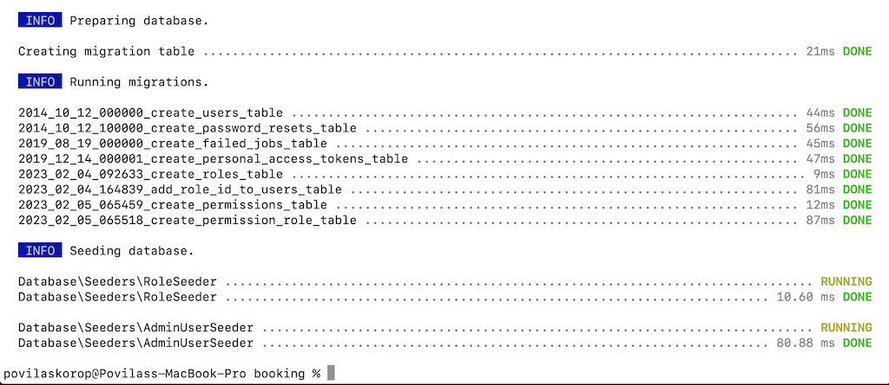
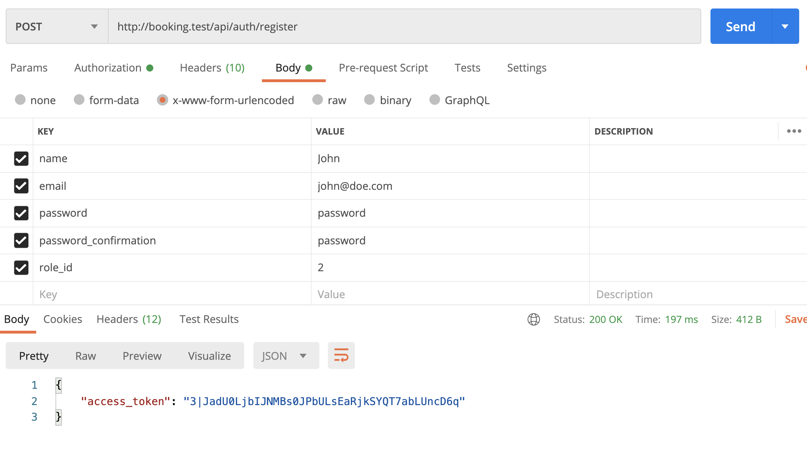
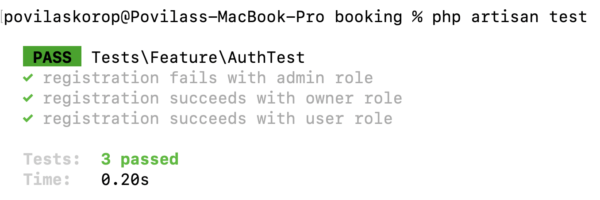
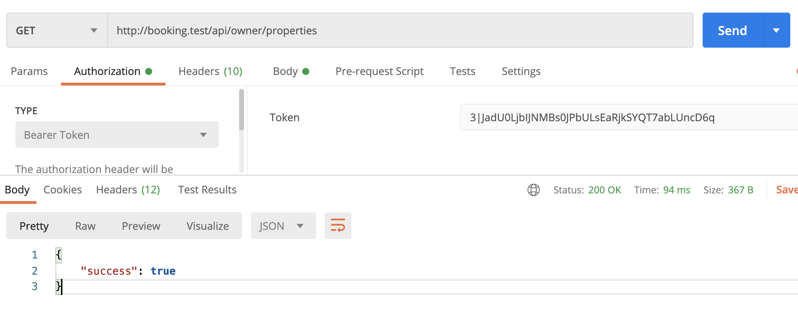

Default Laravel comes with the "users" table, and we need to add roles and permissions on top of that one. And what I want to do here is describe my **way of thinking** about this, so you would understand the alternatives and be prepared to make the decisions for your applications.

Many tutorials start with roles and then go to permissions, but I will start from the other side: let's reverse-engineer what we need roles/permissions FOR.

---

## Goals of This Lesson

- Create our simple DB structure for roles/permissions
- Create first API endpoints and PHPUnit Tests for registration
- Simulate API endpoints for logged-in users and write tests to check permissions
- Alternative: look at the spatie/laravel-permission package

As a result of this lesson, we will launch the automated tests and see this result:


- - - - -

## Simple Permissions with Gates

In our application, we will have features like:

- Manage properties
- Make booking
- Change the user's password
- etc.

Those are all **permissions**. Every user may or may not have permission for some action.

In Laravel's language, permissions are almost the same as [Gates](https://laravel.com/docs/9.x/authorization#gates). 

So, technically speaking, **simple applications may be created with just Users and Gates, without separate Roles/Permissions DB tables**.

In a simple app, if you have just a `users.is_admin` DB column with 0/1 values, you can define:

**app/Providers/AppServiceProvider.php**:
```php
Gate::define('manage-users', function (User $user) {
    return $user->is_admin == 1;
});
```

And then, wherever we have the permission check, instead of checking the role, you should check the permission every time:

**Blade files**:
```blade
@can('manage-users')
   Link to edit user's password
@endcan
```

**UserController.php**:
```php
public function edit(User $user)
{
    $this->authorize('manage-users');
 
    // Return the form to edit the user's password
}
```

But in our case, it's not just the admin. We will have **three** roles, at least:

- Administrator
- Property owner
- Simple User


So, in our case, such Provider would look like this:

**app/Providers/AppServiceProvider.php**:
```php
Gate::define('manage-properties', function (User $user) {
    return $user->is_owner == 1;
});
Gate::define('book-property', function (User $user) {
    return $user->is_user == 1;
});
Gate::define('manage-users', function (User $user) {
    return $user->is_admin == 1;
});

// ... more permissions
```

Those `$user->is_xxxxx` are not that pretty, are they? With dozens of permissions, the provider file would look huge and ugly. So, we DO need to have roles and permissions separately in the database.

- - - - -

## Roles and Permissions in the DB

Instead of those `is_owner` and `is_admin` potential columns in the DB, let's create Roles with a relationship.

```sh
php artisan make:model Role -ms
```

**Migration**:
```php
Schema::create('roles', function (Blueprint $table) {
    $table->id();
    $table->string('name');
    $table->timestamps();
});
```

Make the `name` fillable:

**app/Models/Role.php**:
```php
class Role extends Model
{
    protected $fillable = ['name'];
}
```

And then immediately I would suggest adding a **Seeder** to seed the main roles for the beginning. You noticed that I generated `make:model` with `-s` at the end. So yeah, it generated the Seeder file, which we will in like this:

**database/seeders/RoleSeeder.php**:
```php
use App\Models\Role;

class RoleSeeder extends Seeder
{
    public function run()
    {
        Role::create(['name' => 'Administrator']);
        Role::create(['name' => 'Property Owner']);
        Role::create(['name' => 'Simple User']);
    }
}
```

Next, each role will have multiple Permissions. So let's store them in the database, too. The DB structure is identical to the Role:

```sh
php artisan make:model Permission -m
```

**Migration**:
```php
Schema::create('permissions', function (Blueprint $table) {
    $table->id();
    $table->string('name');
    $table->timestamps();
});
```

**app/Models/Permission.php**:
```php
class Permission extends Model
{
    protected $fillable = ['name'];
}
```

Now, the relationship. It should be a many-to-many, because both each role may have many permissions, and also each permission may belong to many roles.

```sh
php artisan make:migration create_permission_role_table
```

**Migration**:
```php
Schema::create('permission_role', function (Blueprint $table) {
    $table->foreignId('permission_id')->constrained();
    $table->foreignId('role_id')->constrained();
});
```
And we add the methods for relationships, in both Models:

**app/Models/Role.php**:
```php
class Role extends Model
{
    // ...

    public function permissions()
    {
        return $this->belongsToMany(Permission::class);
    }
}
```

**app/Models/Permission.php**:
```php
class Permission extends Model
{
    // ...

    public function roles()
    {
        return $this->belongsToMany(Role::class);
    }
}
```


Ok, great, we have the relationship between roles and permissions. Now, how do we assign roles or permissions to Users?

- - - - - 

## User: One Role or Multiple Roles?

Typically, there are two layers of managing permissions:

- Admin adds the permissions and then specifies which roles have certain permissions
- For users, the admin/system assigns the ROLES to them, which in itself includes the permissions

In other words, we don't assign permissions to the users, we assign only the roles.

So, we need to create the relationship from User to Role. And here's where we have a million-dollar question:

**Should User-Role be a belongsTo or a belongsToMany?**

This, of course, depends on your application needs. To rephrase, "can a user have multiple roles"?

I've seen applications that allow multiple roles, like the same person can be an editor and an administrator, but it makes the system so much more complex, and even confusing.

So, I would vote that, in most cases, you would first choose a more simple approach of one role per user.

I've checked Booking.com itself, and they require **separate** registrations as a user and as a property owner, so you can be either one or another.

That's why we will go for just a `belongsTo` relationship here.

```sh
php artisan make:migration add_role_id_to_users_table
```

**Migration**:
```php
Schema::table('users', function (Blueprint $table) {
    $table->foreignId('role_id')->constrained();
});
```

Then we add that `role_id` to the `$fillable` and define the relationship:

**app/Models/User.php**:
```php
class User extends Authenticatable
{
    // ...

    protected $fillable = [
        'name',
        'email',
        'password',
        'role_id',
    ];

    public function role()
    {
        return $this->belongsTo(Role::class);
    }
}
```

So, at the moment of the registration, our new users will choose whether they are looking for a property to rent, or want to publish their own property for rent.

As for the Administrator, I suggest creating a special Seeder to already have one Administrator in the DB after the project install:

```sh
php artisan make:seeder AdminUserSeeder
```

**database/seeders/AdminUserSeeder.php**:
```php
use App\Models\User;

class AdminUserSeeder extends Seeder
{
    public function run()
    {
        User::create([
            'name' => 'Administrator',
            'email' => 'superadmin@booking.com',
            'password' => bcrypt('SuperSecretPassword'),
            'email_verified_at' => now(),
            'role_id' => 1, // Administrator
        ]);
    }
}
```

Then, we add both seeders to the main `DatabaseSeeder`.

**database/seeders/DatabaseSeeder.php**:
```php
class DatabaseSeeder extends Seeder
{
    public function run()
    {
        $this->call(RoleSeeder::class);
        $this->call(AdminUserSeeder::class);
    }
}
```

And, finally, we can launch the migrations with seeds:

```sh
php artisan migrate --seed
```



Our next goal is to implement the registration API and test that users get their roles correctly.

- - - - - 

## Registration API: Assign Permissions and Test Them

Let's say that we will have two registration forms: one for a simple user, and another for the property owner. So, let's simulate both of them and write automated tests that would check if users get the correct role/permissions.

For now, let's group them into one endpoint `POST /api/auth/register`, because the user registration would be almost identical. In future lessons, we will talk about differences in the profile fields, but both users and property owners are Users with the same fields of name/email/password.

```sh
php artisan make:controller Auth/RegisterController
```

**routes/api.php**:
```php
Route::post('auth/register', App\Http\Controllers\Auth\RegisterController::class);
```

We will create only one method and use the Controller as [Invokable Single-Action Controller](https://laravel.com/docs/9.x/controllers#single-action-controllers).

**app/Http/Controllers/Auth/RegisterController.php**:
```php
namespace App\Http\Controllers\Auth;

use App\Http\Controllers\Controller;
use App\Models\User;
use Illuminate\Http\Request;
use Illuminate\Support\Facades\Hash;
use Illuminate\Validation\Rules\Password;

class RegisterController extends Controller
{
    public function __invoke(Request $request)
    {
        $request->validate([
            'name' => ['required', 'string', 'max:255'],
            'email' => ['required', 'string', 'email', 'max:255', 'unique:users'],
            'password' => ['required', 'confirmed', Password::defaults()],
            'role_id' => ['required', Rule::in(2, 3)],
        ]);

        $user = User::create([
            'name' => $request->name,
            'email' => $request->email,
            'password' => Hash::make($request->password),
            'role_id' => $request->role_id,
        ]);

        return response()->json([
            'access_token' => $user->createToken('client')->plainTextToken,
        ]);
    }
}
```

Here I'm assuming we use Laravel Sanctum for the Auth, so we just return the access token, as for mobile application, and all the subsequent requests would happen with that as a Bearer Token, for the authentication. If you don't know how that works, check out my course [Build Laravel API for Car Parking App: Step-By-Step](https://laraveldaily.com/course/build-laravel-api-step-by-step).

So, after the validation, we can create the User with `role_id => 3`, which is the Simple User, according to our Seeder above.

In the validation, we have that `Rule::in(2, 3)` hardcoded. You would probably agree that this `2, 3` isn't readable or understandable at the first glance to a new developer, as it's hard to remember which role is ID 2 or 3. Let's introduce a few constants inside a Role model.

```php
class Role extends Model
{
    const ROLE_ADMINISTRATOR = 1;
    const ROLE_OWNER = 2;
    const ROLE_USER = 3;

    // ...
}
```

Then, in Controller, we can do this:

```php
use App\Models\Role;

class RegisterController extends Controller
{
    public function __invoke(Request $request)
    {
        $request->validate([
            // ...

            'role_id' => ['required', Rule::in(Role::ROLE_OWNER, Role::ROLE_USER)],
        ]);
```

More readable, isn't it? You could also create a separate [Enum Class](https://php.watch/versions/8.1/enums) for this, but for simplicity, I decided to create those constants in the Model. It's a totally personal preference.

Ok, so we have the user's registration endpoint. Here's how it works in the Postman API client:



Let's test how it works, by building **automated test**.

Let's prepare our test suite first.

In the default Laravel project, I typically delete two example test files

- tests/Feature/ExampleTest.php
- tests/Unit/ExampleTest.php

Also, I edit the default `phpunit.xml` file to uncomment these two lines:

```
<env name="DB_CONNECTION" value="sqlite"/>
<env name="DB_DATABASE" value=":memory:"/>
```

**Notice**: For demo projects like this one, it's typically fine to use an in-memory database, but in the real-world scenario I often set up a separate testing MySQL database to run tests on.

Ok, and now, let's generate our first test that would check if the registration works.

```sh
php artisan make:test AuthTest
```

**tests/Feature/AuthTest.php**:
```php
namespace Tests\Feature;

use App\Models\Role;
use Illuminate\Foundation\Testing\RefreshDatabase;
use Tests\TestCase;

class AuthTest extends TestCase
{
    use RefreshDatabase;

    public function test_registration_fails_with_admin_role()
    {
        $response = $this->postJson('/api/auth/register', [
            'name' => 'Valid name',
            'email' => 'valid@email.com',
            'password' => 'ValidPassword',
            'password_confirmation' => 'ValidPassword',
            'role_id' => Role::ROLE_ADMINISTRATOR
        ]);

        $response->assertStatus(422);
    }

    public function test_registration_succeeds_with_owner_role()
    {
        $response = $this->postJson('/api/auth/register', [
            'name' => 'Valid name',
            'email' => 'valid@email.com',
            'password' => 'ValidPassword',
            'password_confirmation' => 'ValidPassword',
            'role_id' => Role::ROLE_OWNER
        ]);

        $response->assertStatus(200)->assertJsonStructure([
            'access_token',
        ]);
    }

    public function test_registration_succeeds_with_user_role()
    {
        $response = $this->postJson('/api/auth/register', [
            'name' => 'Valid name',
            'email' => 'valid@email.com',
            'password' => 'ValidPassword',
            'password_confirmation' => 'ValidPassword',
            'role_id' => Role::ROLE_USER
        ]);

        $response->assertStatus(200)->assertJsonStructure([
            'access_token',
        ]);
    }
}
```

As you can see, we have three methods, each of which tests the registration with each of the roles. By the way, see how constants like `Role::ROLE_OWNER` paid off here as well, the test code is really readable.

The result: our registration works!



- - - - - 

Finally, in this lesson, let's create a few endpoints for the **logged-in users** and test if we have the correct access to them.

Let's say that our property owner will have access to the list of their properties, and the regular user will have access to their bookings. 

So we will create those endpoints, without any functionality for now, just with the `Gates` to check the permissions.

Let's add those permissions as a seeder, and group them for more permissions in the future.

```sh
php artisan make:seeder PermissionSeeder
```

**database/seeders/PermissionSeeder.php**:
```php
namespace Database\Seeders;

use App\Models\Permission;
use App\Models\Role;
use Illuminate\Database\Console\Seeds\WithoutModelEvents;
use Illuminate\Database\Seeder;

class PermissionSeeder extends Seeder
{
    /**
     * Run the database seeds.
     *
     * @return void
     */
    public function run()
    {
        $allRoles = Role::all()->keyBy('id');

        $permissions = [
            'properties-manage' => [Role::ROLE_OWNER],
            'bookings-manage' => [Role::ROLE_USER],
        ];

        foreach ($permissions as $key => $roles) {
            $permission = Permission::create(['name' => $key]);
            foreach ($roles as $role) {
                $allRoles[$role]->permissions()->attach($permission->id);
            }
        }
    }
}
```

Now, as we have all the other data in the DB already, we can run this single seeder:

```sh
php artisan db:seed --class=PermissionSeeder
```

And now let's use those permissions on the actual routes.

```sh
php artisan make:controller Owner/PropertyController
php artisan make:controller User/BookingController
```

**routes/api.php**:
```php
Route::post('auth/register', \App\Http\Controllers\Auth\RegisterController::class);

Route::middleware('auth:sanctum')->group(function() {
    // No owner/user grouping, for now, will do it later with more routes
    Route::get('owner/properties',
        [\App\Http\Controllers\Owner\PropertyController::class, 'index']);
    Route::get('user/bookings',
        [\App\Http\Controllers\User\BookingController::class, 'index']);
});
```

And then let's use our Gates in the Controllers:

**app/Http/Controllers/Owner/PropertyController.php**:
```php
namespace App\Http\Controllers\Owner;

use App\Http\Controllers\Controller;

class PropertyController extends Controller
{
    public function index()
    {
        $this->authorize('properties-manage');

        // Will implement property management later
        return response()->json(['success' => true]);
    }
}
```

**app/Http/Controllers/User/BookingController.php**:
```php
namespace App\Http\Controllers\User;

use App\Http\Controllers\Controller;
use Illuminate\Http\Request;

class BookingController extends Controller
{
    public function index()
    {
        $this->authorize('bookings-manage');

        // Will implement booking management later
        return response()->json(['success' => true]);
        
    }
}
```

Now, for `$this->authorize()` to work, we need to actually **define** the Gates for the application. Currently, the permissions are in our database, but depending on the current user's role, we need to set every Gate to a true/false value for the user.

We will generate a Middleware specifically for that and enable that Middleware to run on every API request.

```sh
php artisan make:middleware GateDefineMiddleware
```

**app/Http/Middleware/GateDefineMiddleware.php**:
```php
namespace App\Http\Middleware;

use App\Models\Permission;
use Closure;
use Illuminate\Http\Request;
use Illuminate\Support\Facades\Gate;

class GateDefineMiddleware
{
    public function handle(Request $request, Closure $next)
    {
        if (auth()->check()) {
            $permissions = Permission::whereHas('roles', function($query) {
                $query->where('id', auth()->user()->role_id);
            })->get();

            foreach ($permissions as $permission) {
                Gate::define($permission->name, fn() => true);
            }
        }

        return $next($request);
    }
}
```

As you can see, we launch `Gate::define()` only on those permissions that are assigned to the `role_id` of the logged-in user. For other permissions, the Gate will not be defined, so it will return `false` when checking for that permission.

We register our middleware to run in the `api` group.

**app/Http/Kernel.php**:
```php
use App\Http\Middleware\GateDefineMiddleware;

class Kernel extends HttpKernel
{
    // ...

    protected $middlewareGroups = [
        'web' => [
            // ...
        ],

        'api' => [
            // \Laravel\Sanctum\Http\Middleware\EnsureFrontendRequestsAreStateful::class,
            'throttle:api',
            \Illuminate\Routing\Middleware\SubstituteBindings::class,
            GateDefineMiddleware::class,
        ],
    ];

    // ...
}
```

Now, all we need to do to check if the middleware is working is to launch the API endpoints for the user and the property owner separately, with the Bearer Token that we received from the registration endpoint.

Here's how it looks in Postman:



And when access is denied:


Now, automated tests should cover those cases, too. So let's generate one.

```sh
php artisan make:test PropertiesTest
```

**tests/Feature/PropertiesTest.php**:
```php
namespace Tests\Feature;

use App\Models\Role;
use App\Models\User;
use Illuminate\Foundation\Testing\RefreshDatabase;
use Tests\TestCase;

class PropertiesTest extends TestCase
{
    use RefreshDatabase;

    public function test_property_owner_has_access_to_properties_feature()
    {
        $owner = User::factory()->create(['role_id' => Role::ROLE_OWNER]);
        $response = $this->actingAs($owner)->getJson('/api/owner/properties');

        $response->assertStatus(200);
    }

    public function test_user_does_not_have_access_to_properties_feature()
    {
        $owner = User::factory()->create(['role_id' => Role::ROLE_USER]);
        $response = $this->actingAs($owner)->getJson('/api/owner/properties');

        $response->assertStatus(403);
    }
}
```

At this point, we don't care what that `/api/owner/properties` returns inside, we care if it's successful (code 200) or forbidden (code 403).

To make this work, we need to make a change in the base TestCase to run the **seeds** for the roles/permissions, for our tests. Cause the default `RefreshDatabase` will just run the migrations, but not the data seeds.

**tests/TestCase.php**:
```php
abstract class TestCase extends BaseTestCase
{
    use CreatesApplication;

    public function setUp(): void
    {
        parent::setUp();

        $this->seed(); // THIS IS THE LINE WE NEED
    }
}
```

Also, in the same fashion, let's generate the identical test to check for the bookings list permissions as a simple user.

```sh
php artisan make:test BookingsTest
```

**tests/Feature/BookingsTest.php**:
```php
namespace Tests\Feature;

use App\Models\Role;
use App\Models\User;
use Illuminate\Foundation\Testing\RefreshDatabase;
use Tests\TestCase;

class BookingsTest extends TestCase
{
    use RefreshDatabase;

    public function test_user_has_access_to_bookings_feature()
    {
        $owner = User::factory()->create(['role_id' => Role::ROLE_USER]);
        $response = $this->actingAs($owner)->getJson('/api/user/bookings');

        $response->assertStatus(200);
    }

    public function test_property_owner_does_not_have_access_to_bookings_feature()
    {
        $owner = User::factory()->create(['role_id' => Role::ROLE_OWNER]);
        $response = $this->actingAs($owner)->getJson('/api/user/bookings');

        $response->assertStatus(403);
    }
}
```

Now, we launch `php artisan test`, and...


We successfully simulated the registration for two user roles and their permissions for specific API endpoints!

- - - - -

## Alternative: Spatie Permission Package

There's another popular approach to adding roles/permissions to Laravel projects: package [spatie/laravel-permission](https://github.com/spatie/laravel-permission).

It would replace our own DB structure, and instead of manually attaching/detaching permissions, we will work with the package functions like `$user->assignRole('Administrator')` and similar ones.

I've tried it on the same project and committed the code to a [separate branch in the repository](https://github.com/LaravelDaily/Booking-Com-Simulation-Laravel/commit/52974438c53334b5c1ee8b57e2ac08da4025365f), let's review the differences and changes I've made.

First, we install the package and publish its assets.

```sh
composer require spatie/laravel-permission
php artisan vendor:publish --provider="Spatie\Permission\PermissionServiceProvider"
```

Then, before we run the migrations, we need to remove our own ones. We don't need our own DB structure for roles/permissions, as the package will have their own migrations for this.

So we delete the migrations for:

- migration for `roles`
- migration for `permissions`
- migration for pivot `permission_role` table
- column `role_id` from `users` migrations

Then we run `php artisan migrate` to get the package tables into our DB.

Next, the Models. Again, we don't need our own models, because the package has its own `Role` and `Permission` models, with the same field "name" in the structure.

So, we delete the `App\Models\Permission.php` file.

With the Role model, it's a bit more tricky, because we've added an extra feature: the constants like `Role::ROLE_OWNER` which we use all over our project. 

So we leave the Role model inside our project, just instead of extending the Model from Eloquent, we extend the Spatie package Role model.

**app/Models/Role.php**:
```php
namespace App\Models;
 
class Role extends \Spatie\Permission\Models\Role
{
    use HasFactory;
 
    const ROLE_ADMINISTRATOR = 1;
    const ROLE_OWNER = 2;
    const ROLE_USER = 3;
}
```

Next, the Seeds. They will look a bit different, cause we need to switch from our own DB structure to use the package's features. Only the `RoleSeeder` doesn't change at all, the other ones will look like this.

**database/seeders/AdminUserSeeder.php**:
```php
    public function run()
    {
        $user = User::create([
            'name' => 'Administrator',
            'email' => 'superadmin@booking.com',
            'password' => bcrypt('SuperSecretPassword'),
            'email_verified_at' => now(),
            
            // no more role_id here
        ]);

        $user->assignRole('Administrator');
    }
}
```

**database/seeders/PermissionSeeder.php**:
```php
use Spatie\Permission\Models\Permission;

// We change only two lines: 
// - Permission model from the package
// - attach() to givePermissionTo()

class PermissionSeeder extends Seeder
{
    public function run()
    {
        $allRoles = Role::all()->keyBy('id');

        $permissions = [
            'properties-manage' => [Role::ROLE_OWNER],
            'bookings-manage' => [Role::ROLE_USER],
        ];

        foreach ($permissions as $key => $roles) {
            $permission = Permission::create(['name' => $key]);
            foreach ($roles as $role) {
                $allRoles[$role]->givePermissionTo($permission);                
            }
        }
    }
}
```

Similarly, in the Registration Controller, we need to change assigning `role_id` to the `$user->assignRole()`.

**app/Http/Controllers/Auth/RegisterController.php**:
```php
class RegisterController extends Controller
{
    public function __invoke(Request $request)
    {
        // ...

        $user = User::create([
            'name' => $request->name,
            'email' => $request->email,
            'password' => Hash::make($request->password),
        ]);

        $user->assignRole($request->role_id);

        // ...
    }
}
```

Next, we don't need our own Middleware, the `Gate::define()` things will be taken over by the package.

- Delete the file `GateDefineMiddleware`
- Remove its mention from `app/Http/Kernel.php`


Finally, we change our Tests to use the package feature of `assignRole()`.

**tests/Feature/BookingsTest.php**:
```php
class BookingsTest extends TestCase
{
    public function test_user_has_access_to_bookings_feature()
    {
        $user = User::factory()->create()->assignRole(Role::ROLE_USER);
        $response = $this->actingAs($user)->getJson('/api/user/bookings');

        $response->assertStatus(200);
    }

    public function test_property_owner_does_not_have_access_to_bookings_feature()
    {
        $owner = User::factory()->create()->assignRole(Role::ROLE_OWNER);
        $response = $this->actingAs($owner)->getJson('/api/user/bookings');

        $response->assertStatus(403);
    }
}
```

**tests/Feature/PropertiesTest.php**:
```php
class PropertiesTest extends TestCase
{
    public function test_property_owner_has_access_to_properties_feature()
    {
        $owner = User::factory()->create()->assignRole(Role::ROLE_OWNER);
        $response = $this->actingAs($owner)->getJson('/api/owner/properties');

        $response->assertStatus(200);
    }

    public function test_user_does_not_have_access_to_properties_feature()
    {
        $user = User::factory()->create()->assignRole(Role::ROLE_USER);
        $response = $this->actingAs($user)->getJson('/api/owner/properties');

        $response->assertStatus(403);
    }
}
```

And if we relaunch `php artisan test`, the test should all pass!

Notice that we haven't changed anything in the Owner/User Controllers. It's all still the same: `$this->authorize('properties-manage');` and `$this->authorize('bookings-manage');`.

That's because Spatie uses the same Gate mechanism as we did before using the package, it just adds its own DB layer on top.

The main difference, however, is the database structure and the queries executed. In the Spatie package case, it's trying to be very flexible, using polymorphic relations and allowing users to have multiple roles (*which we don't need, as discussed earlier*). 

Also, the package is running queries in "live mode" when checking the permissions. In our case, we're running the DB query only once in the Middleware, and then comparing the Gates whenever we need to check them.

Typical DB query without Spatie package - get all permissions by role:
```
select
  *
from
  "permissions"
where
  exists (
    select
      *
    from
      "roles"
      inner join "permission_role" on "roles"."id" = "permission_role"."role_id"
    where
      "permissions"."id" = "permission_role"."permission_id"
      and "id" = 3
  )
```

A typical query of the Spatie package - get all permissions by user:
```
select
  "permissions".*,
  "model_has_permissions"."model_id" as "pivot_model_id",
  "model_has_permissions"."permission_id" as "pivot_permission_id",
  "model_has_permissions"."model_type" as "pivot_model_type"
from
  "permissions"
  inner join "model_has_permissions" on "permissions"."id" = "model_has_permissions"."permission_id"
where
  "model_has_permissions"."model_id" = 2
  and "model_has_permissions"."model_type" = 'App\Models\User'
```

So, it's your personal preference whether to use the package or not. I've just shown it to you as an alternative. 

I would vote for it in the case when you do need users to have many roles, as it is supported in the package by default.

Again, the code is [in the repository branch](https://github.com/LaravelDaily/Booking-Com-Simulation-Laravel/commit/52974438c53334b5c1ee8b57e2ac08da4025365f).

