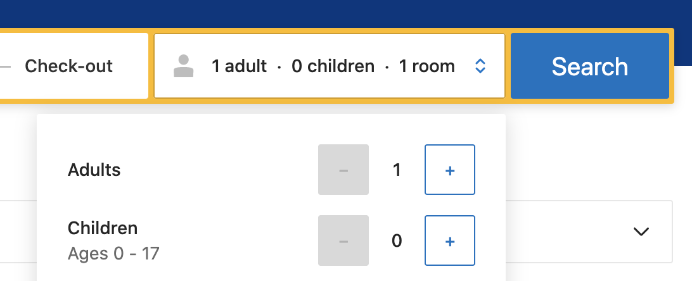
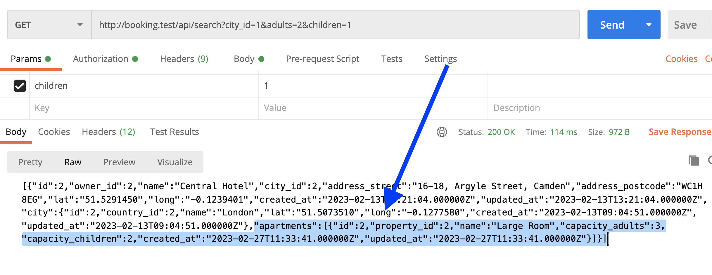

Now we're moving to the next filter in the search: people are looking for properties fit for their needs of space, by specifying the number of adults and children arriving.



Here's where we get to the next concept: **apartments**. Each property may have multiple apartments, not only for hotels but also for bigger houses are often divided into separate apartments for booking.

So, our search needs to accept the number of adults and children and filter the properties by apartments that are fit for that number of people.

First, we create the Apartment model/migration, also adding a Factory for testing.

```sh
php artisan make:model Apartment -mf
```

**Migration file**:
```php
Schema::create('apartments', function (Blueprint $table) {
    $table->id();
    $table->foreignId('property_id')->constrained();
    $table->string('name');
    $table->unsignedInteger('capacity_adults');
    $table->unsignedInteger('capacity_children');
    $table->timestamps();
});
```

**app/Models/Apartment.php**:
```php
class Apartment extends Model
{
    use HasFactory;

    protected $fillable = [
        'property_id',
        'name',
        'capacity_adults',
        'capacity_children'
    ];

    public function property()
    {
        return $this->belongsTo(Property::class);
    }
}
```

Also, we add a relationship of `apartments` for a Property.

**app/Models/Property.php**:
```php
class Property extends Model
{
    // ...

    public function apartments()
    {
        return $this->hasMany(Apartment::class);
    }
}
```

Now, we can extend our search with two more fields: `adults` and `children`. It adds another `when()` condition to our Eloquent query.

**app/Http/Controllers/User/PropertySearchController.php**:
```php
class PropertySearchController extends Controller
{
    public function __invoke(Request $request)
    {
        return Property::with('city')
            ->when($request->city, function($query) use ($request) {
                $query->where('city_id', $request->city);
            })
            // ... more when() conditions
            ->when($request->adults && $request->children, function($query) use ($request) {
                $query->withWhereHas('apartments', function($query) use ($request) {
                    $query->where('capacity_adults', '>', $request->adults)
                        ->where('capacity_children', '>', $request->children);
                });
            })
            ->get();
    }
}
```

Here, we're using a `->withWhereHas()` method that appeared in Laravel 9.17, see [my video](https://www.youtube.com/watch?v=ZEDUihpRQMM) about it.

Here's the result in Postman:



Finally, let's test if it works. We add another method to our Search Testing class.

**tests/Feature/PropertySearchTest.php**:
```php
public function test_property_search_by_capacity_returns_correct_results(): void
{
    $owner = User::factory()->create(['role_id' => Role::ROLE_OWNER]);
    $cityId = City::value('id');
    $propertyWithSmallApartment = Property::factory()->create([
        'owner_id' => $owner->id,
        'city_id' => $cityId,
    ]);
    Apartment::factory()->create([
        'property_id' => $propertyWithSmallApartment->id,
        'capacity_adults' => 1,
        'capacity_children' => 0,
    ]);
    $propertyWithLargeApartment = Property::factory()->create([
        'owner_id' => $owner->id,
        'city_id' => $cityId,
    ]);
    Apartment::factory()->create([
        'property_id' => $propertyWithLargeApartment->id,
        'capacity_adults' => 3,
        'capacity_children' => 2,
    ]);

    $response = $this->getJson('/api/search?city=' . $cityId . '&adults=2&children=1');

    $response->assertStatus(200);
    $response->assertJsonCount(1);
    $response->assertJsonFragment(['id' => $propertyWithLargeApartment->id]);
}
```

As you can see, we're creating two properties: one with a small apartment for only 1 adult, and another one fitting 3 adults and 2 children. Our search queries for the properties for 2 adults and 1 child, and only `$propertyWithLargeApartment` should be returned.

To create a fake apartment, we fill in the Factory with fields like these:

**database/factories/ApartmentFactory.php**:
```php
class ApartmentFactory extends Factory
{
    public function definition(): array
    {
        return [
            'property_id' => Property::value('id'),
            'name' => fake()->text(20),
            'capacity_adults' => rand(1, 5),
            'capacity_children' => rand(1, 5),
        ];
    }
}
```

We launch that exact one test: 

```sh
php artisan test --filter=test_property_search_by_capacity_returns_correct_results
```

And it works!


---

## Showing Only Suitable Apartments

Finally in this lesson, let's add another test, checking if we don't return the apartments that are not a good fit.

As you may notice, Booking.com shows the results as a list of properties, each with a list of suitable apartments. So if the hotel has both smaller and bigger apartments, it will show only bigger ones that would fit the family.


We already created the code for it, by using `withWhereHas()` instead of just `whereHas()`. We just need to write the test method for it, here's how it would look.

**tests/Feature/PropertySearchTest.php**:
```php
public function test_property_search_by_capacity_returns_only_suitable_apartments(): void
{
    $owner = User::factory()->create(['role_id' => Role::ROLE_OWNER]);
    $cityId = City::value('id');
    $property = Property::factory()->create([
        'owner_id' => $owner->id,
        'city_id' => $cityId,
    ]);
    $smallApartment = Apartment::factory()->create([
        'name' => 'Small apartment',
        'property_id' => $property->id,
        'capacity_adults' => 1,
        'capacity_children' => 0,
    ]);
    $largeApartment = Apartment::factory()->create([
        'name' => 'Large apartment',
        'property_id' => $property->id,
        'capacity_adults' => 3,
        'capacity_children' => 2,
    ]);

    $response = $this->getJson('/api/search?city=' . $cityId . '&adults=2&children=1');

    $response->assertStatus(200);
    $response->assertJsonCount(1);
    $response->assertJsonCount(1, '0.apartments');
    $response->assertJsonPath('0.apartments.0.name', $largeApartment->name);
}
```

As you can see, we're diving deeper into the result of JSON structure testing, with `assertJsonCount()` and `assertJsonPath()`. You can read more about available methods [in the official Laravel docs](https://laravel.com/docs/10.x/http-tests).

Now, we launch the test...

```sh
php artisan test --filter=test_property_search_by_capacity_returns_only_suitable_apartments
```

Another green light!


