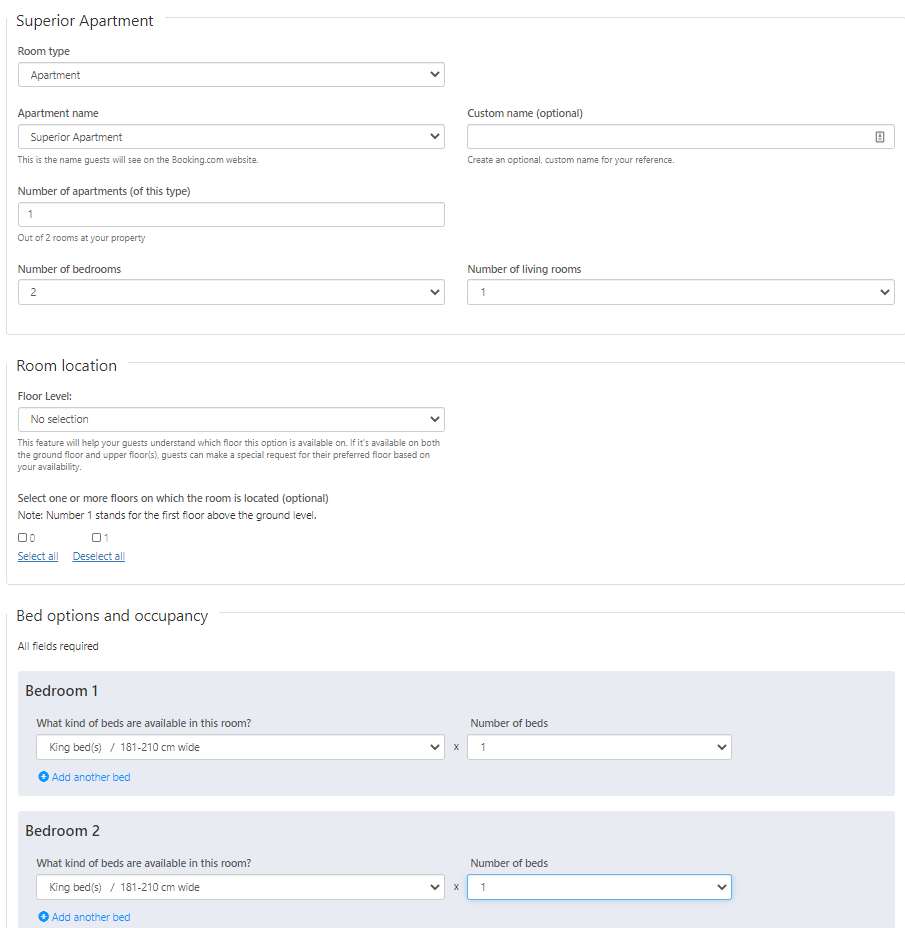

Now, let's try to show the property and room information in the search results, similarly to how it's done on Booking.com website:

- Every apartment may have size in square meters, number of small/large/sofa beds, number of bedrooms, living rooms and bathrooms
- In property search, we need to show only ONE apartment which is the best fit for the number of guests
- Other apartments may be seen if someone clicks on the property, so we need to create an API endpoint for that 

## DB Structure: Apartment Size and Type

TBD.

## Apartment Rooms

Our DB structure will get a bit more complicated, with rooms within apartments:

- Bedrooms (specifying beds in each one)
- Living rooms (also can have beds)
- Bathrooms

In reality, the travelers are filtering for the number of spots to sleep: large bed can usually fit 2 people, king size bed may fit even more.

So this is exactly what the property owner should specify. I found these form screenshots online:




So we will add these tables to the DB:


Let's add more fields to the rooms DB table. They will all be nullable.

Migration

And they all should be fillable.

Model code

Now, we need to specify those fields to be returned in the Room object, among the search results.

So let's create a resource for the Property, with the first version of its structure, likely to have changes in the future.

```sh
php artisan make:resource PropertyResource
php artisan make:resource RoomResource
```

**app/Http/Resources/PropertyResource.php**:
```php
Code
```

These are the main fields that we need for the fields.

Code

See what we've done with the rooms here? We're loading them with their own API resource, defined like this.

**app/Http/Resources/RoomResource.php**:
```php
Code
```

And we use those resources in the Search Controller, like this:

Code

Important notice: Eloquent API Resources automatically wrap all data into another layer of "data", here's the example in Postman:

Image

Therefore we need to change our automated tests to accept that newly changed structure.

Code with tl++ changes

Also, let's expand automated tests to check that unwanted fields are not returned in the search results.

Tests code

