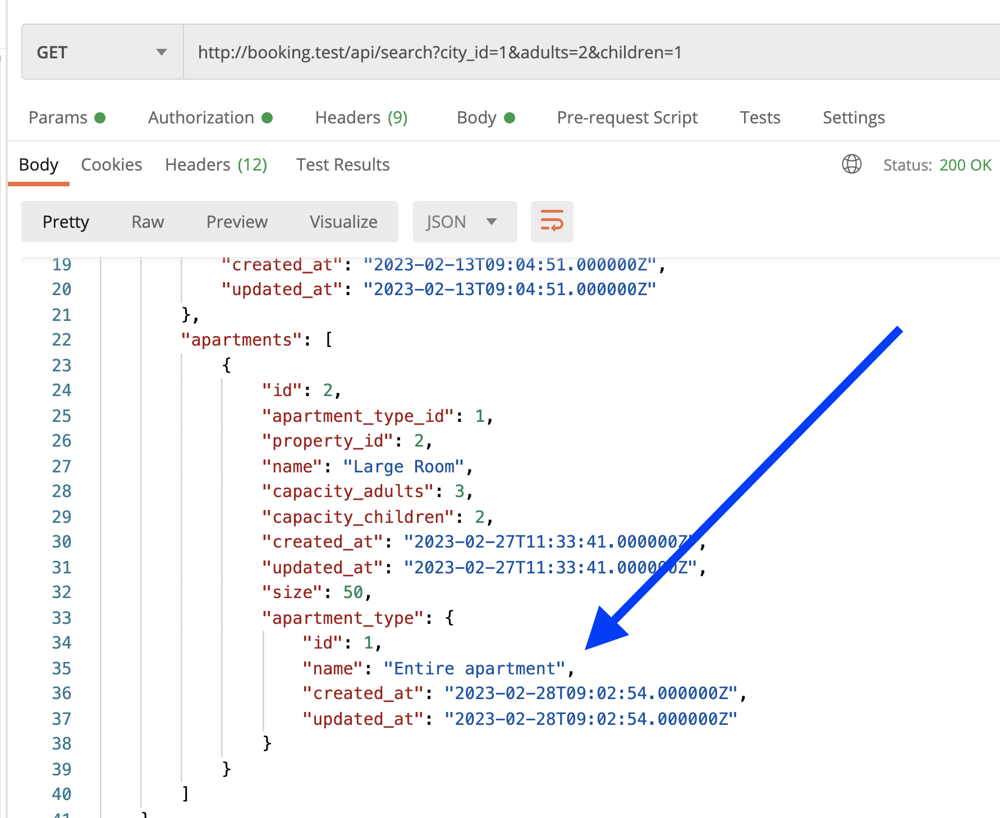

Now, let's try to show the property and apartment information in the search results, similarly to how it's done on Booking.com website:

- Every apartment may have its type, size in square meters, number of small/large/sofa beds, number of bedrooms, living rooms and bathrooms
- In property search, we need to show only ONE apartment which is the best fit for the number of guests
- Other apartments may be seen if someone clicks on the property, so we need to create an API endpoint for that 

Let's tackle those, one by one.

- - -

## DB Structure: Apartment Type and Size

Let's add two fields to the apartments: their type and size (in square meters).

Types should have a separate DB table, with a relationship, so we do exactly that.

```sh
php artisan make:model ApartmentType -m
```

**Migration file**:
```php
use App\Models\ApartmentType;

public function up(): void
{
    Schema::create('apartment_types', function (Blueprint $table) {
        $table->id();
        $table->string('name');
        $table->timestamps();
    });

    ApartmentType::create(['name' => 'Entire apartment']);
    ApartmentType::create(['name' => 'Entire studio']);
    ApartmentType::create(['name' => 'Private suite']);
}
```

For such simple seeds, I often prefer doing them right in the migration file, instead of creating a separate Seeder. But that's a personal preference.

The Model is very simple.

**app/Models/ApartmentType.php**:
```php
class ApartmentType extends Model
{
    use HasFactory;

    protected $fillable = ['name'];
}
```

Next, we create a migration for adding both type and size.

```sh
php artisan make:migration add_apartment_type_size_to_apartments_table
```

**Migration file**:
```php
public function up(): void
{
    Schema::table('apartments', function (Blueprint $table) {
        $table->foreignId('apartment_type_id')
            ->nullable()
            ->after('id')
            ->constrained();
        $table->unsignedInteger('size')->nullable();
    });
}
```

Apartment type should be `nullable`, as I've noticed on the page that not all apartments show their type.

Next, we add those fields to the fillables in the Model and create a relationship to the type.

**app/Models/Apartment.php**:
```php
class Apartment extends Model
{
    protected $fillable = [
        'property_id',
        'apartment_type_id',
        'name',
        'capacity_adults',
        'capacity_children',
        'size',
    ];

    public function apartment_type()
    {
        return $this->belongsTo(ApartmentType::class);
    }
}
```

Finally, we need to modify our search to return that type as a relationship.

**app/Http/Controllers/Public/PropertySearchController.php**:
```php
class PropertySearchController extends Controller
{
    public function __invoke(Request $request)
    {
        return Property::with('city', 'apartments.apartment_type')
            // ... when() conditions
            ->get();
    }
}
```

These are new fields, visible in the search results now:



- - - 

## Apartment Rooms

Our DB structure will get a bit more complicated, with rooms within apartments:

- Bedrooms (specifying beds in each one)
- Living rooms (also can have beds)
- Bathrooms

In reality, the travelers are filtering for the number of spots to sleep: large bed can usually fit 2 people, king size bed may fit even more.

So this is exactly what the property owner should specify. I found these form screenshots online:


So we will add these tables to the DB:


Let's add more fields to the rooms DB table. They will all be nullable.

Migration

And they all should be fillable.

Model code

Now, we need to specify those fields to be returned in the Room object, among the search results.

So let's create a resource for the Property, with the first version of its structure, likely to have changes in the future.

```sh
php artisan make:resource PropertyResource
php artisan make:resource RoomResource
```

**app/Http/Resources/PropertyResource.php**:
```php
Code
```

These are the main fields that we need for the fields.

Code

See what we've done with the rooms here? We're loading them with their own API resource, defined like this.

**app/Http/Resources/RoomResource.php**:
```php
Code
```

And we use those resources in the Search Controller, like this:

Code

Important notice: Eloquent API Resources automatically wrap all data into another layer of "data", here's the example in Postman:

Image

Therefore we need to change our automated tests to accept that newly changed structure.

Code with tl++ changes

Also, let's expand automated tests to check that unwanted fields are not returned in the search results.

Tests code

