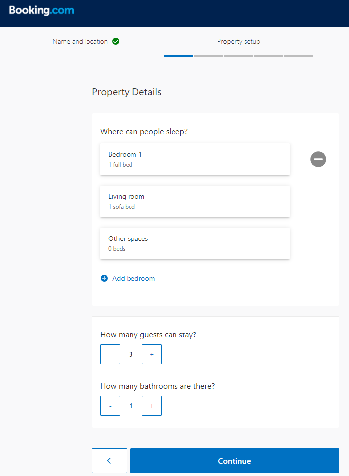
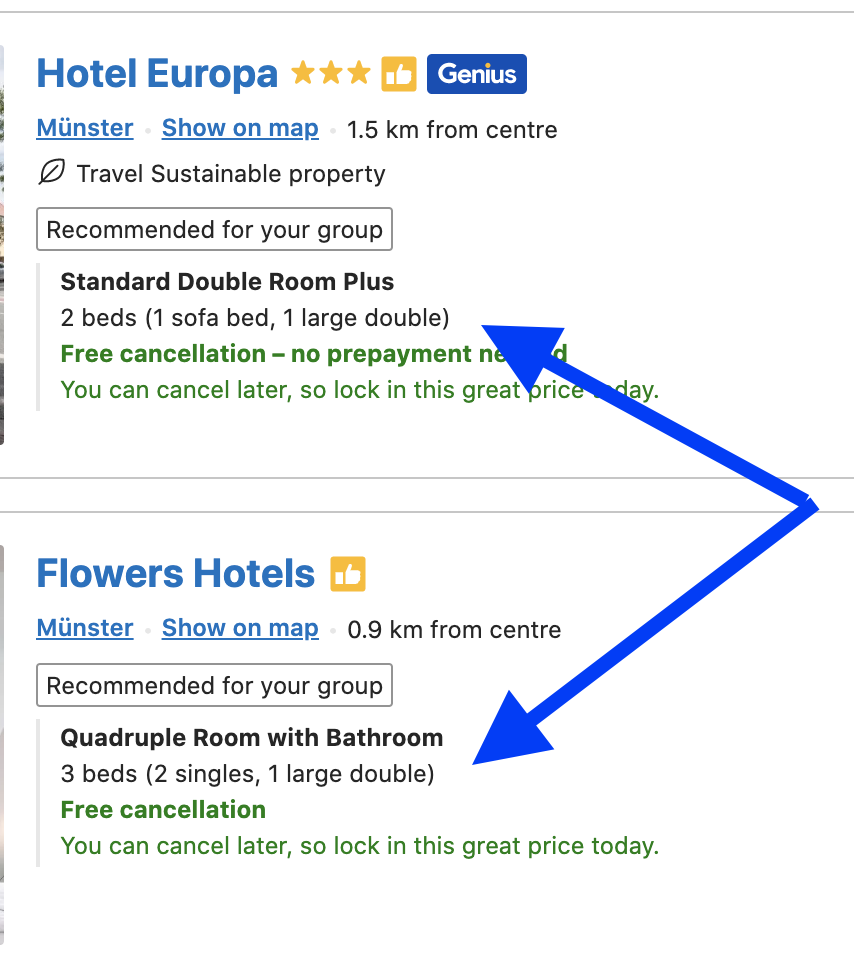

Now, let's try to show the property and apartment information in the search results, similarly to how it's done on Booking.com website:


As you can see, every apartment may have its type, size in square meters, number of small/large/sofa beds, number of bedrooms, living rooms and bathrooms. So let's return all of that.

---

## Goals of This Lesson

- Create DB structure for Apartment Type and size
- Create DB structure for Rooms and Beds with Bed Types
- Showing Rooms and Beds in Search Results
- Look at a different project scenario: doctors/patients

By the end of this lesson, we will have this DB structure:


- - -

## DB Structure: Apartment Type and Size

Let's add two fields to the apartments: their type and size (in square meters).

Types should have a separate DB table, with a relationship, so we do exactly that.

```sh
php artisan make:model ApartmentType -m
```

**Migration file**:
```php
use App\Models\ApartmentType;

public function up(): void
{
    Schema::create('apartment_types', function (Blueprint $table) {
        $table->id();
        $table->string('name');
        $table->timestamps();
    });

    ApartmentType::create(['name' => 'Entire apartment']);
    ApartmentType::create(['name' => 'Entire studio']);
    ApartmentType::create(['name' => 'Private suite']);
}
```

For such simple seeds, I often prefer doing them right in the migration file, instead of creating a separate Seeder. But that's a personal preference.

The Model is very simple.

**app/Models/ApartmentType.php**:
```php
class ApartmentType extends Model
{
    use HasFactory;

    protected $fillable = ['name'];
}
```

Next, we create a migration for adding both type and size.

```sh
php artisan make:migration add_apartment_type_size_to_apartments_table
```

**Migration file**:
```php
public function up(): void
{
    Schema::table('apartments', function (Blueprint $table) {
        $table->foreignId('apartment_type_id')
            ->nullable()
            ->after('id')
            ->constrained();
        $table->unsignedInteger('size')->nullable();
    });
}
```

Apartment type should be `nullable`, as I've noticed on the page that not all apartments show their type.

Next, we add those fields to the fillables in the Model and create a relationship to the type.

**app/Models/Apartment.php**:
```php
class Apartment extends Model
{
    protected $fillable = [
        'property_id',
        'apartment_type_id', // [tl! ++]
        'name',
        'capacity_adults',
        'capacity_children',
        'size', // [tl! ++]
    ];

    public function apartment_type()
    {
        return $this->belongsTo(ApartmentType::class);
    }
}
```

Finally, we need to modify our search to return that type as a relationship.

**app/Http/Controllers/Public/PropertySearchController.php**:
```php
class PropertySearchController extends Controller
{
    public function __invoke(Request $request)
    {
        return Property::with('city', 'apartments.apartment_type')
            // ... when() conditions
            ->get();
    }
}
```

These are new fields, visible in the search results now:


- - - 

## Apartment Rooms and Beds: DB Structure

Our DB structure will get a bit more complicated, with rooms within apartments:

- Bedrooms (specifying beds in each one)
- Living rooms (also may have beds)
- Bathrooms

In reality, the travelers are filtering for the number of **spots to sleep**: large bed can usually fit 2 people, king size bed may fit even more.

So this is exactly what the property owner should specify. I found these form screenshots online:




There are actually two types of rooms: with and without beds. So I think it's safe to assume that for no-beds rooms we're interested only in their amount.

So we can add `bathrooms` as a simple field in the `apartments` table.

**Migration file**:
```php
Schema::table('apartments', function (Blueprint $table) {
    $table->unsignedInteger('bathrooms')->default(0);
});
```

Adding it to fillables in the Model.

**app/Models/Apartment.php**:
```php
class Apartment extends Model
{
    protected $fillable = [
        'property_id',
        'apartment_type_id',
        'name',
        'capacity_adults',
        'capacity_children',
        'size',
        'bathrooms', // [tl! ++]
    ];
```

So this was a simple part. Now, other rooms with beds, that structure will be more complicated. 

I suggest this logic:

- Separate DB table "room_types", seeding types "Bedroom" and "Living Room"
- Separate DB table "rooms" with `belongsTo(Apartment::class)` and `belongsTo(RoomType::class)` relationships
- Separate DB table "bed_types", seeding types like "Single bed", "Large double bed", "Extra large double bed", "Sofa bed"
- Separate DB table "beds" with `belongsTo(Room::class)` and `belongsTo(BedType::class)` relationships

So, step by step.

```sh
php artisan make:model RoomType -m
```

**Migration file**:
```php
use App\Models\RoomType;

return new class extends Migration
{
    public function up(): void
    {
        Schema::create('room_types', function (Blueprint $table) {
            $table->id();
            $table->string('name');
            $table->timestamps();
        });

        RoomType::create(['name' => 'Bedroom']);
        RoomType::create(['name' => 'Living room']);
    }
};
```

Again, a few records seeded inside the migration file itself, no need for a separate seeder.

Next, fillable field in the Model.

**app/Models/RoomType.php**:
```php
class RoomType extends Model
{
    use HasFactory;

    protected $fillable = ['name'];
}
```

Next, the Room model.

```sh
php artisan make:model Room -m
```

**Migration file**:
```php
public function up(): void
{
    Schema::create('rooms', function (Blueprint $table) {
        $table->id();
        $table->foreignId('apartment_id')->constrained();
        $table->foreignId('room_type_id')->nullable()->constrained();
        $table->string('name');
        $table->timestamps();
    });
}
```

**app/Models/Room.php**:
```php
class Room extends Model
{
    use HasFactory;

    protected $fillable = ['apartment_id', 'room_type_id', 'name'];

    public function room_type()
    {
        return $this->belongsTo(RoomType::class);
    }
}
```

Let's also create a `hasMany` relationship from Apartments.

**app/Models/Apartment.php**:
```php
class Apartment extends Model
{
    // ...

    public function rooms()
    {
        return $this->hasMany(Room::class);
    }
}
```

Next, Bed Types.

```sh
php artisan make:model BedType -m
```

**Migration file**:
```php
use App\Models\BedType;

return new class extends Migration
{
    public function up(): void
    {
        Schema::create('bed_types', function (Blueprint $table) {
            $table->id();
            $table->string('name');
            $table->timestamps();
        });

        BedType::create(['name' => 'Single bed']);
        BedType::create(['name' => 'Large double bed']);
        BedType::create(['name' => 'Extra large double bed']);
        BedType::create(['name' => 'Sofa bed']);
    }
};
```

**app/Models/BedType.php**:
```php
class BedType extends Model
{
    use HasFactory;

    protected $fillable = ['name'];
}
```

Finally, the Beds model. I've been thinking whether a bed should have a **name**, but let it exists but be nullable :)

```sh
php artisan make:model Bed -m
```

**Migration file**:
```php
public function up(): void
{
    Schema::create('beds', function (Blueprint $table) {
        $table->id();
        $table->foreignId('room_id')->constrained();
        $table->foreignId('bed_type_id')->constrained();
        $table->string('name')->nullable();
        $table->timestamps();
    });
}
```

**app/Models/Bed.php**:
```php
class Bed extends Model
{
    use HasFactory;

    protected $fillable = ['room_id', 'bed_type_id', 'name'];

    public function room()
    {
        return $this->belongsTo(Room::class);
    }

    public function bed_type()
    {
        return $this->belongsTo(BedType::class);
    }
}
```

Also let's create a `hasMany` relationship from Rooms to Beds:

**app/Models/Room.php**:
```php
class Room extends Model
{
    // ...

    public function beds()
    {
        return $this->hasMany(Bed::class);
    }
}
```

Great, so we have this DB structure, visually:


---

## Rooms and Beds in Search Results

Now, remember, our goal is to return the search results with rooms and beds as a **summary**:



Currently, in we have this:

```php
Property::with('city', 'apartments.apartment_type')->when(...)->get();
```

So we need to expand that `with()` part with rooms and beds.

**app/Http/Controllers/Public/PropertySearchController.php**:
```php
class PropertySearchController extends Controller
{
    public function __invoke(Request $request)
    {
        return Property::query()
            ->with([
                'city',
                'apartments.apartment_type',
                'apartments.rooms.beds.bed_type'
            ])
            ->when(...)
            ->when(...)
            ->get();
```

I've changed `with()` to accept an array and formatted the sentence with `query()` to be on a separate line.

The result is a pretty huge JSON. Postman screenshot wouldn't fit, so posting the actual result.

Endpoint: `/api/search?city_id=1&adults=2&children=1`

Result JSON:

```json
[
    {
        "id": 2,
        "owner_id": 2,
        "name": "Central Hotel",
        "city_id": 2,
        "address_street": "16-18, Argyle Street, Camden",
        "address_postcode": "WC1H 8EG",
        "lat": "51.5291450",
        "long": "-0.1239401",
        "created_at": "2023-02-13T13:21:04.000000Z",
        "updated_at": "2023-02-13T13:21:04.000000Z",
        "city": {
            "id": 2,
            "country_id": 2,
            "name": "London",
            "lat": "51.5073510",
            "long": "-0.1277580",
            "created_at": "2023-02-13T09:04:51.000000Z",
            "updated_at": "2023-02-13T09:04:51.000000Z"
        },
        "apartments": [
            {
                "id": 2,
                "apartment_type_id": 1,
                "property_id": 2,
                "name": "Large Apartment",
                "capacity_adults": 3,
                "capacity_children": 2,
                "created_at": "2023-02-27T11:33:41.000000Z",
                "updated_at": "2023-02-27T11:33:41.000000Z",
                "size": 50,
                "bathrooms": 0,
                "apartment_type": {
                    "id": 1,
                    "name": "Entire apartment",
                    "created_at": "2023-02-28T09:02:54.000000Z",
                    "updated_at": "2023-02-28T09:02:54.000000Z"
                },
                "rooms": [
                    {
                        "id": 1,
                        "apartment_id": 2,
                        "room_type_id": 1,
                        "name": "Bedroom",
                        "created_at": "2023-03-02T10:07:05.000000Z",
                        "updated_at": "2023-03-02T10:07:05.000000Z",
                        "beds": [
                            {
                                "id": 1,
                                "room_id": 1,
                                "bed_type_id": 1,
                                "name": null,
                                "created_at": "2023-03-02T10:08:22.000000Z",
                                "updated_at": "2023-03-02T10:08:22.000000Z",
                                "bed_type": {
                                    "id": 1,
                                    "name": "Single bed",
                                    "created_at": "2023-03-02T07:37:43.000000Z",
                                    "updated_at": "2023-03-02T07:37:43.000000Z"
                                }
                            },
                            {
                                "id": 2,
                                "room_id": 1,
                                "bed_type_id": 2,
                                "name": null,
                                "created_at": "2023-03-02T10:08:22.000000Z",
                                "updated_at": "2023-03-02T10:08:22.000000Z",
                                "bed_type": {
                                    "id": 2,
                                    "name": "Large double bed",
                                    "created_at": "2023-03-02T07:37:43.000000Z",
                                    "updated_at": "2023-03-02T07:37:43.000000Z"
                                }
                            }
                        ]
                    },
                    {
                        "id": 2,
                        "apartment_id": 2,
                        "room_type_id": 2,
                        "name": "Living Room",
                        "created_at": "2023-03-02T10:07:05.000000Z",
                        "updated_at": "2023-03-02T10:07:05.000000Z",
                        "beds": []
                    }
                ]
            }
        ]
    }
]
```

Great, so we're delivering the data from the API, but that JSON size becomes a problem. In the next lesson, let's spend time optimizing it and loading what front-end **actually** needs.