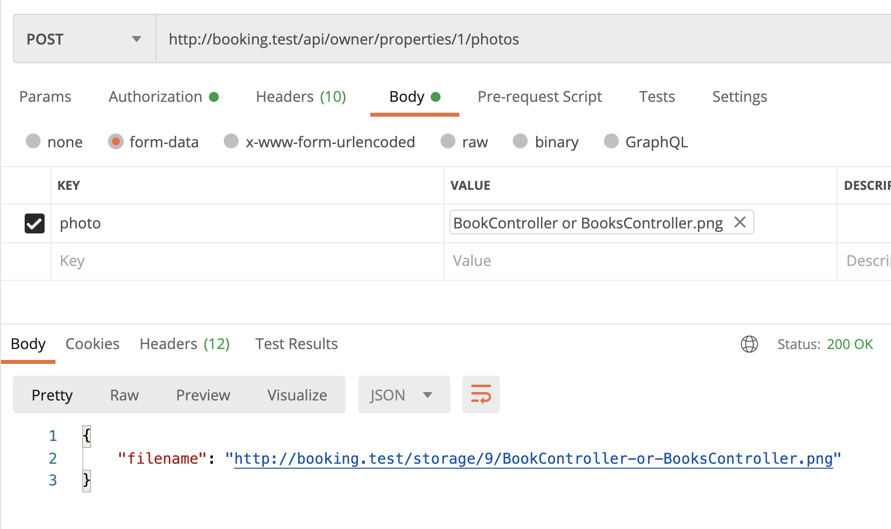
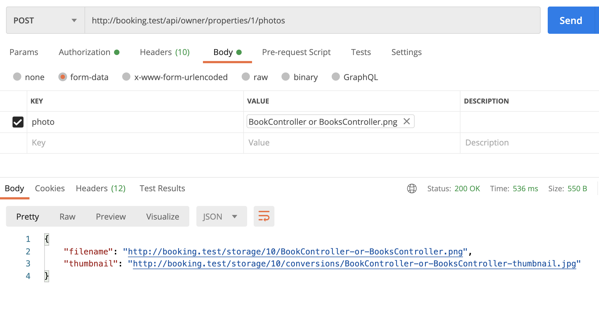
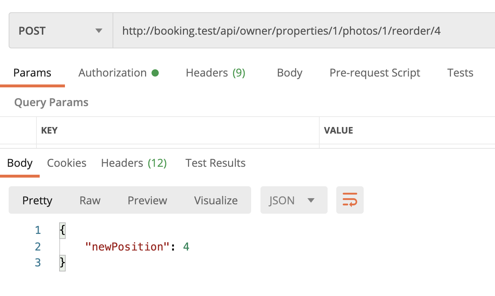

Now it's time to take care of the **photos** for the properties. Each property may have multiple photos, assign order to them, and one of them should be marked "main". Simple, right?

---

## Preparing For Photo Upload

Personally, I'm a big fan of the package [spatie/laravel-medialibrary](https://github.com/spatie/laravel-medialibrary) to manage images. So we will try to use exactly that one.

Four terminal commands for that one:

```sh
composer require "spatie/laravel-medialibrary:^10.0.0"
php artisan vendor:publish --provider="Spatie\MediaLibrary\MediaLibraryServiceProvider" --tag="migrations"
php artisan migrate
php artisan vendor:publish --provider="Spatie\MediaLibrary\MediaLibraryServiceProvider" --tag="config"
```

It will create a new `media` DB table to handle images with polymorphic relations. That kind of relationships fits our project really well because currently our images are attached to properties, but maybe in the future they will be attached to other DB tables, like apartments or rooms.

Next, we will enable the Media Library for the model, where we want to attach the files, which is Property.

**app/Models/Property.php**:
```php
// ...
use Spatie\MediaLibrary\HasMedia;
use Spatie\MediaLibrary\InteractsWithMedia;

class Property extends Model implements HasMedia
{
    use InteractsWithMedia;

    // ...
```

---

## Endpoint to Upload Photo

Next, we will build an API endpoint to upload a photo to the property.

```sh
php artisan make:controller Owner/PropertyPhotoController
```

We will use Route Model binding for the property, so the route would look like this:

**routes/api.php**:
```php
Route::prefix('owner')->group(function () {
    // ... older routes of the owner

    Route::post('properties/{property}/photos',
        [\App\Http\Controllers\Owner\PropertyPhotoController::class, 'store']);
});
```

And this is the main code of the Controller method:

**app/Http/Controllers/Owner/PropertyPhotoController.php**:
```php
namespace App\Http\Controllers\Owner;

use App\Http\Controllers\Controller;
use App\Models\Property;
use Illuminate\Http\Request;

class PropertyPhotoController extends Controller
{
    public function store(Property $property, Request $request)
    {
    	// ...
    }
}
```

Now, let's fill in that Controller method with what it should do:

- Security check: property should belong to the logged-in user, so no one would upload the file to someone else's property
- Validation: file should be image with 5 MB size max
- Upload the file and assign it to the collection with Media Library


Here's the code for all of it:

**app/Http/Controllers/Owner/PropertyPhotoController.php**:
```php
public function store(Property $property, Request $request)
{
    $request->validate([
        'photo' => ['image', 'max:5000']
    ]);

    if ($property->owner_id != auth()->id()) {
        abort(403);
    }

    $photo = $property->addMediaFromRequest('photo')->toMediaCollection('photos');

    return [
        'filename' => $photo->getUrl(),
    ];
}
```

There's an open question about what that Controller method should return. I decided that it should return the full URL of the uploaded file.

And that's it: here's the result in the Postman!



**Notice**. By default, Spatie Media Library package will store the files in your `public` disk, which is in `storage/app/public` according to Laravel default standard. You can customize both in `config/filesystems.php` and/or `config/medialibrary.php` files.

**Notice 2**. For your `storage/app/public` folder to be actually visible in public in the browser, you need to run the command `php artisan storage:link`.

The final thing for the file upload is to build a thumbnail image for the original file, cause probably we would like to show a smaller version of the photo if the initial file is quite large.

For that, Spatie Media Library has a concept of **Media Conversions**, you just need to define them in the Model, as one method.

**app/Models/Property.php**:
```php
class Property extends Model implements HasMedia
{
	// ...

    public function registerMediaConversions(Media $media = null): void
    {
        $this->addMediaConversion('thumbnail')
            ->width(800);
    }
}
```

And that's it: whenever we add a new file to the Media Collection, it will try to build a thumbnail with 800px width, automatically.

Let's actually return that one, too, in the Controller.

**app/Http/Controllers/Owner/PropertyPhotoController.php**:
```php
public function store(Property $property, Request $request)
{
    // ...

    $photo = $property->addMediaFromRequest('photo')->toMediaCollection('photos');

    return [
        'filename' => $photo->getUrl(),
        'thumbnail' => $photo->getUrl('thumbnail')
    ];
}
```

And here's the updated result in Postman:



Now, let's write an automated test for this, I will put it as a new method to already existing test file of `PropertiesTest`. 

To test the file uploads, we need to call `Storage::fake();` in the beginning of the method, here's the full code of that test method.

**tests/Feature/PropertiesTest.php**:
```php
// ...

use Illuminate\Http\UploadedFile;
use Illuminate\Support\Facades\Storage;

class PropertiesTest extends TestCase
{
    // ... other methods

    public function test_property_owner_can_add_photo_to_property()
    {
        Storage::fake();

        $owner = User::factory()->create(['role_id' => Role::ROLE_OWNER]);
        $cityId = City::value('id');
        $property = Property::factory()->create([
            'owner_id' => $owner->id,
            'city_id' => $cityId,
        ]);

        $response = $this->actingAs($owner)->postJson('/api/owner/properties/' . $property->id . '/photos', [
            'photo' => UploadedFile::fake()->image('photo.png')
        ]);

        $response->assertStatus(200);
        $response->assertJsonFragment([
            'filename' => config('app.url') . '/storage/1/photo.png',
            'thumbnail' => config('app.url') . '/storage/1/conversions/photo-thumbnail.jpg',
        ]);
    }
}
```

As you can see, we're creating a property, then post a JSON request with a fake file via `UploadedFile::fake()->image()` and then assert the results to be returned correctly.

From my testing, I've noticed that Media Library builds the thumbnails as `.jpg` files, even if the original is `.png`, so we assert exactly that.

---

## Reordering Photos

It's necessary for property owners to define the order, how photos appear in the app or on the website. So let's build exactly that.

First, we add a column `position` to the DB table `media`. In addition to adding the field, we will do two more things:

- Assign it a default value of 1
- Immediately add a DB index, because I feel we will always show the photos ordered by position


```sh
php artisan make:migration add_position_to_media_table
```

**Migration file**:
```php
public function up(): void
{
    Schema::table('media', function (Blueprint $table) {
        $table->unsignedInteger('position')->default(1)->index();
    });
}
```

I would gladly add this column into `$fillable` array in the Model, but in this case we're dealing with the Eloquent Model `Media` from the package, which is not public by default. We could do that by extending it and building our own model something like `MyMedia`, but I don't want it to get too complicated, for now.

Next, we need to assign the default value for the position, for every new photo, it should be something like `max(position) + 1` for the current property. We could do that in Observer, but again, for simplicity I defined it directly in the Controller now.

Also, let's return that position as a part of the final JSON result.

**app/Http/Controllers/Owner/PropertyPhotoController.php**:
```php
public function store(Property $property, Request $request)
{
    // ...

    $photo = $property->addMediaFromRequest('photo')->toMediaCollection('photos');

    $position = Media::query()
        ->where('model_type', 'App\Models\Property')
        ->where('model_id', $property->id)
        ->max('position') + 1;
    $photo->position = $position;
    $photo->save();

    return [
        'filename' => $photo->getUrl(),
        'thumbnail' => $photo->getUrl('thumbnail'),
        'position' => $photo->position
    ];
}
```

Now, every time we add a new photo for the same property, it will get positions of 1, 2, 3, and so on.

Finally, let's build the **reordering** feature. There are so many ways to implement it, both on the front-end and the back-end, I decided to go with the method where user wants to assign a new position to the existing photo.

As a "side effect" of that, positions of a few other photos should be also changed automatically.

The route looks like this.

**routes/api.php**:
```php
Route::prefix('owner')->group(function () {
	// ...

    Route::post('properties/{property}/photos',
        [\App\Http\Controllers\Owner\PropertyPhotoController::class, 'store']);
    Route::post('properties/{property}/photos/{photo}/reorder/{newPosition}',
        [\App\Http\Controllers\Owner\PropertyPhotoController::class, 'reorder']);
});
```

How would that `reorder()` method look like? Again, there could be many implementations, after a few experiments I landed on this one.

**app/Http/Controllers/Owner/PropertyPhotoController.php**:
```php
public function reorder(Property $property, Media $photo, int $newPosition)
{
    if ($property->owner_id != auth()->id() || $photo->model_id != $property->id) {
        abort(403);
    }

    $query = Media::query()
        ->where('model_type', 'App\Models\Property')
        ->where('model_id', $photo->model_id);
    if ($newPosition < $photo->position) {
        $query
            ->whereBetween('position', [$newPosition, $photo->position-1])
            ->increment('position');
    } else {
        $query
            ->whereBetween('position', [$photo->position+1, $newPosition])
            ->decrement('position');
    }
    $photo->position = $newPosition;
    $photo->save();

    return [
        'newPosition' => $photo->position
    ];
}
```

So, what is happening inside that method?

1. Security check for the property/photo parameters
2. Building the query for **related** photos to be reordered
3. Depending on the `$newPosition`, we increment/decrement their positions
4. Finally, update the current photo position.

Again, it's debatable what we should return, I went with just the new position.

Postman result looks like this:



There could be more validation happening here, for min/max of `$newPosition` parameter, for example, but I will leave it for you as a "homework" if you wish to take the extra step.

**Notice**. Booking.com also has a feature of "main photo", so property owners may set any of their photos as the main one. But personally, I think we will simplify that and just show the photo with `position = 1` as the main one. And if property owners want to change the main photo, they would just call the API endpoint with `/reorder/1` at the end.

Now, the automated test for this? I decided to write only one case of reordering "one position down", but in theory, there should be more cases covered, for ordering up/down and a few places. Again, you can spend extra time on it, if you wish :)

Also, this time I allowed myself to be "lazy" and not create a separate factory for Media models, to create two fake photos. I just fired two additional API calls for that, inside the test.

**tests/feature/PropertiesTest.php**:
```php
public function test_property_owner_can_reorder_photos_in_property()
{
    Storage::fake();

    $owner = User::factory()->create(['role_id' => Role::ROLE_OWNER]);
    $cityId = City::value('id');
    $property = Property::factory()->create([
        'owner_id' => $owner->id,
        'city_id' => $cityId,
    ]);

    // I admit I'm lazy here: 2 API calls to upload files, instead of building a factory
    $photo1 = $this->actingAs($owner)->postJson('/api/owner/properties/' . $property->id . '/photos', [
        'photo' => UploadedFile::fake()->image('photo1.png')
    ]);
    $photo2 = $this->actingAs($owner)->postJson('/api/owner/properties/' . $property->id . '/photos', [
        'photo' => UploadedFile::fake()->image('photo2.png')
    ]);

    $newPosition = $photo1->json('position') + 1;
    $response = $this->actingAs($owner)->postJson('/api/owner/properties/' . $property->id . '/photos/1/reorder/' . $newPosition);
    $response->assertStatus(200);
    $response->assertJsonFragment(['newPosition' => $newPosition]);

    $this->assertDatabaseHas('media', ['file_name' => 'photo1.png', 'position' => $photo2->json('position')]);
    $this->assertDatabaseHas('media', ['file_name' => 'photo2.png', 'position' => $photo1->json('position')]);
}
```

Notice how I use `$photo1->json('position')` instead of hardcoding the reordering so that instead of `$newPosition` I would just use the number "2"? That is deliberate, as the test methods should be independent from other test methods: what if some other test method already uploaded the file with number 2? Then our test would fail. So, I use the variables from the test itself, to make sure it's consistent.

---