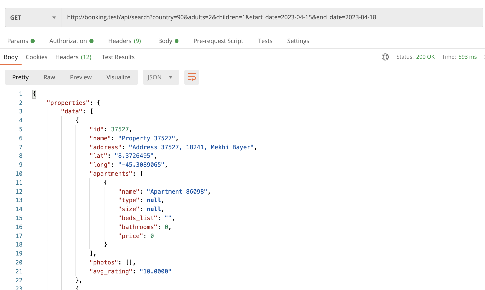
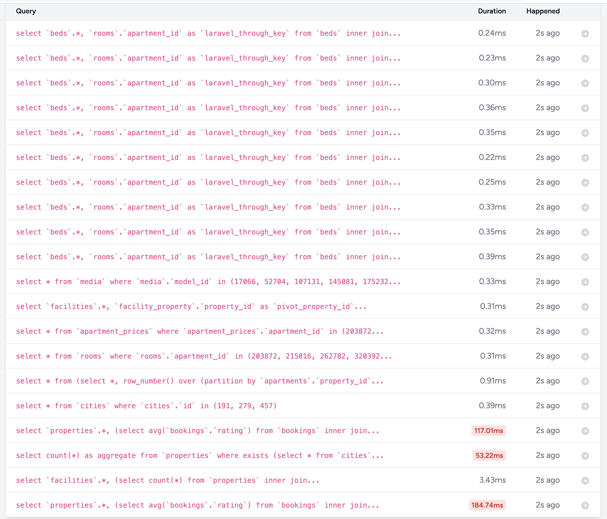
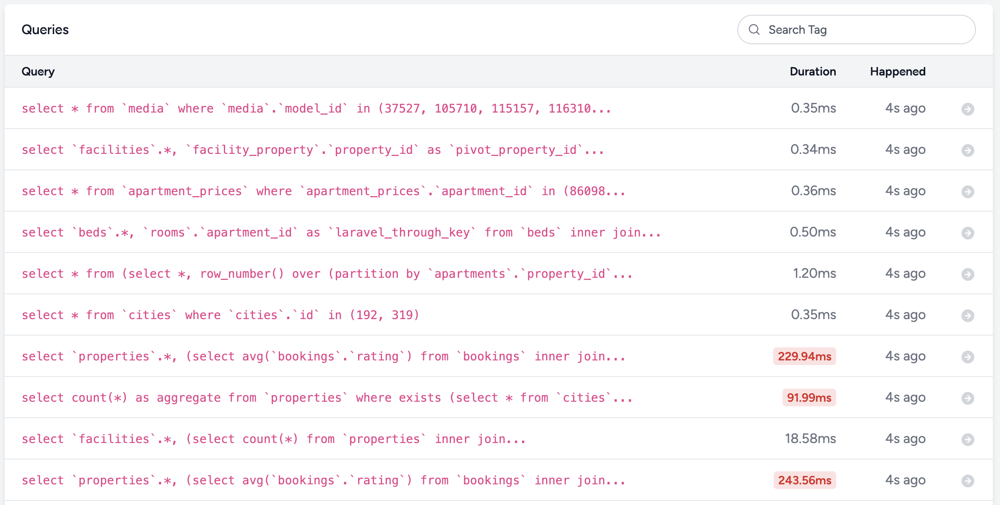
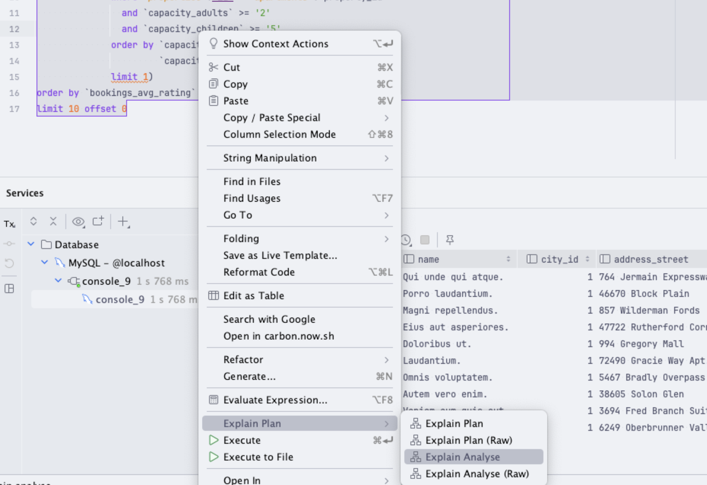
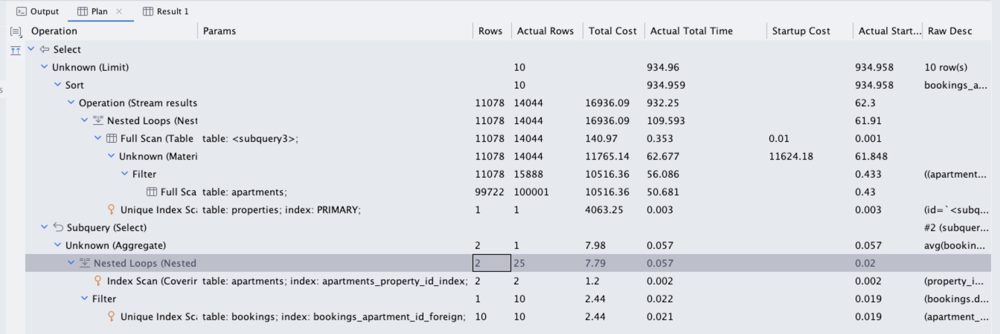

Now let's start testing the performance of our search query, which is pretty complex and large. 

---

## First Postman Run with Big Data

For testing, I've used the seeder from the previous lesson a few times, with even bigger data, so currently I have:

- 300 000 properties
- 600 000 apartments (2 apartments per property)
- 1 200 000 bookings

And here's a reminder of how the Search Controller method looks like:

**app/Http/Controllers/Public/PropertySearchController.php**:
```php
public function __invoke(Request $request)
{
    $propertiesQuery = Property::query()
        ->with([
            'city',
            'apartments.apartment_type',
            'apartments.beds', 
            'apartments.rooms.beds.bed_type',
            'apartments.prices' => function($query) use ($request) {
                $query->validForRange([
                    $request->start_date ?? now()->addDay()->toDateString(),
                    $request->end_date ?? now()->addDays(2)->toDateString(),
                ]);
            },
            'facilities',
            'media' => fn($query) => $query->orderBy('position'),
        ])
        ->withAvg('bookings', 'rating')
        ->when($request->city, function($query) use ($request) {
            $query->where('city_id', $request->city);
        })
        ->when($request->country, function($query) use ($request) {
            $query->whereHas('city', fn($q) => $q->where('country_id', $request->country));
        })
        ->when($request->geoobject, function($query) use ($request) {
            $geoobject = Geoobject::find($request->geoobject);
            if ($geoobject) {
                $condition = "(
                    6371 * acos(
                        cos(radians(" . $geoobject->lat . "))
                        * cos(radians(`lat`))
                        * cos(radians(`long`) - radians(" . $geoobject->long . "))
                        + sin(radians(" . $geoobject->lat . ")) * sin(radians(`lat`))
                    ) < 10
                )";
                $query->whereRaw($condition);
            }
        })
        ->when($request->adults && $request->children, function($query) use ($request) {
            $query->withWhereHas('apartments', function($query) use ($request) {
                $query->where('capacity_adults', '>=', $request->adults)
                    ->where('capacity_children', '>=', $request->children)
                    ->when($request->start_date && $request->end_date, function($query) use ($request) {
                        $query->whereDoesntHave('bookings', function($q) use ($request) {
                            $q->validForRange([$request->start_date, $request->end_date]);
                        });
                    })
                    ->orderBy('capacity_adults')
                    ->orderBy('capacity_children')
                    ->take(1);
            });
        })
        ->when($request->facilities, function($query) use ($request) {
            $query->whereHas('facilities', function($query) use ($request) {
                $query->whereIn('facilities.id', $request->facilities);
            });
        })
        ->when($request->price_from, function($query) use ($request) {
            $query->whereHas('apartments.prices', function($query) use ($request) {
                $query->where('price', '>=', $request->price_from);
            });
        })
        ->when($request->price_to, function($query) use ($request) {
            $query->whereHas('apartments.prices', function($query) use ($request) {
                $query->where('price', '<=', $request->price_to);
            });
        })
        ->orderBy('bookings_avg_rating', 'desc');

    $facilities = Facility::query()
        ->withCount(['properties' => function ($property) use ($propertiesQuery) {
            $property->whereIn('id', $propertiesQuery->pluck('id'));
        }])
        ->get()
        ->where('properties_count', '>', 0)
        ->sortByDesc('properties_count')
        ->pluck('properties_count', 'name');

    $properties = $propertiesQuery->paginate(10)->withQueryString();

    return [
        'properties' => PropertySearchResource::collection($properties)
            ->response()
            ->getData(true),
        'facilities' => $facilities,
    ];
}
```

Looks quite complex, but maybe the performance is ok? 

First, let's just try to launch the endpoint in Postman:



Returns result in `0.593s`. Is it good or bad?

In theory, the response under 1 second should be good. But imagine hundreds of users browsing the website/app at the same time, and it can accumulate quite fast. So let's still try to optimize and lower that number down as much as we can.

---

## First Run with Laravel Telescope

How can we measure the Eloquent queries? In a visual website project, we would install [Laravel Debugbar](https://github.com/barryvdh/laravel-debugbar) and look at the numbers at the bottom of a webpage. But here we have API, so what tool should we use?

[Laravel Telescope](https://laravel.com/docs/10.x/telescope) is one of the options. 

```sh
composer require laravel/telescope
php artisan telescope:install
php artisan migrate
```

As a result of this, we will have a few new DB tables with prefix `telescope_*****` where it would store everything it monitors (it's much more than just DB queries).


---

**Side note**: important change for seeders. Since Laravel Telescope will monitor/measure every DB query, we need to disable that behavior in seeders, otherwise we will have huge polluted logs with millions of irrelevant `insert` statements.

**database/seeders/PerformanceTestingSeeder.php**:
```php
use Laravel\Telescope\Telescope;

class PerformanceTestingSeeder extends Seeder
{
    public function run(): void
    {
        Telescope::stopRecording();

        $this->call([
            RoleSeeder::class,
            // ... other seeders
        ]);
    }
}
```

---

Now, let's run the same Postman request, but with Telescope enabled, we will see the SQL queries under the hood.

So we load `/telescope/queries` in the browser and see this:



So, we see 20 SQL queries. What can we identify as problem(s)?

1. An obvious [N+1 Query](https://laraveldaily.com/tag/n1-query) problem, loading `beds` and `rooms` from DB for each of the 10 properties
2. Three queries identified as `slow` (see screenshow below), so we will investigate/improve them later in this lesson

Those "slow" queries are, by default, identified as ones running **over 100ms**. But for this tutorial, I've changed that default value to `50ms`:

**config/telescope.php**:
```php
// ...

Watchers\QueryWatcher::class => [
    'enabled' => env('TELESCOPE_QUERY_WATCHER', true),
    'ignore_packages' => true,
    'ignore_paths' => [],
    'slow' => 50, // <-- THIS
],
```

Ok, now let's fix the problems, one by one.

---

## N+1 Query: Eager Loading with hasManyThrough

This is a great example of a "hidden" N+1 query. I thought I always used Eager Loading whenever possible, we do have the `with()` code, right?

```php
Property::query()
    ->with([
        'city',
        'apartments.apartment_type',
        'apartments.rooms.beds.bed_type',
        // ... others
    ])
    ->withAvg('bookings', 'rating')
    // ->when()
    // ->when()
    // ->when()
    // ->when()
    ->get();
```

And, wait a minute, we DO load the `beds` and `rooms` here! So why Eloquent doesn't take them and still performs separate queries?

The problem is that we load the 4-level relationship: `apartments.rooms.beds.bed_type`.

But in the code of calculating the Beds string, in the Apartment model, we call the `beds` directly as a separate `hasManyThrough` relationship.

**app/Models/Apartment.php**:
```php
public function rooms()
{
    return $this->hasMany(Room::class);
}

public function beds()
{
    return $this->hasManyThrough(Bed::class, Room::class);
}
```

So you can load the Beds from this relationship, or from this one:

**app/Models/Room.php**:
```php
public function beds()
{
    return $this->hasMany(Bed::class);
}
```

And in the Accessor attribute, we load it like this:

**app/Models/Apartment.php**:
```php
public function bedsList(): Attribute
{
    $allBeds = $this->beds;
    $bedsByType = $allBeds->groupBy('bed_type.name');
    $bedsList = '';
    if ($bedsByType->count() == 1) {
        $bedsList .= '...';
    }

    // ...

    return new Attribute(
        get: fn () => $bedsList
    );
}
```

See that `$this->beds`? We're using the `hasManyThrough` relationship. But in the Controller we're loading the longer way, including `rooms`, which we actually don't need in the search results.

All that long explanation to show that we need to make this small change:

```php
$propertiesQuery = Property::query()
    ->with([
        'city',
        'apartments.apartment_type',
        // 'apartments.rooms.beds.bed_type',
        'apartments.beds.bed_type',
```

Let's reload the Postman endpoint, and we shouldn't see those extra queries.



Great, first optimization done!

---

## One Small Improvement for AVERAGE

From what I see, we have two slowest queries, so let's focus on those two, which are nearly identical.

I will remind you the decision we made earlier:

- We form a Query Builder query `$propertiesQuery` but not launching it yet
- We get the IDs of properties with `$propertiesQuery->pluck('id')` for the facilities - so that's one DB query
- And then we take 10 paginated properties with `$propertiesQuery->paginate(10)` - so that's another DB query

The good thing is that on DB level some of those conditions will be cached and the second almost-identical query will run faster just because of that.

So we're dealing with this SQL query - it looks like a beast at the first glance, but actually it's pretty normal:

```
select
  `properties`.*,
  (
    select
      avg(`bookings`.`rating`)
    from
      `bookings`
      inner join `apartments` on `apartments`.`id` = `bookings`.`apartment_id`
    where
      `properties`.`id` = `apartments`.`property_id`
      and `bookings`.`deleted_at` is null
  ) as `bookings_avg_rating`
from
  `properties`
where
  exists (
    select
      *
    from
      `cities`
    where
      `properties`.`city_id` = `cities`.`id`
      and `country_id` = '85'
  )
  and exists (
    select
      *
    from
      `apartments`
    where
      `properties`.`id` = `apartments`.`property_id`
      and `capacity_adults` >= '2'
      and `capacity_children` >= '1'
      and not exists (
        select
          *
        from
          `bookings`
        where
          `apartments`.`id` = `bookings`.`apartment_id`
          and (
            (
              `start_date` >= '2023-04-15'
              and `end_date` <= '2023-04-18'
            )
            or (
              `start_date` between '2023-04-15'
              and '2023-04-18'
              or `end_date` between '2023-04-15'
              and '2023-04-18'
            )
            or (
              `start_date` <= '2023-04-15'
              and `end_date` >= '2023-04-18'
            )
          )
          and `bookings`.`deleted_at` is null
      )
    order by
      `capacity_adults` asc,
      `capacity_children` asc
    limit
      1
  )
order by
  `bookings_avg_rating` desc
```

And what I've noticed now is that we're calculating the **rating** for both queries, although we need it only for the paginated query, and not for the ID facility query.

So let's move those rating things from the first query, to the level where we actually paginate the results.

So, instead of:

```php
$propertiesQuery = Property::query()
    // ->with(...)
    ->withAvg('bookings', 'rating')
    // ->when(...)
    // ->when(...)
    // ->when(...)
    ->orderBy('bookings_avg_rating', 'desc');

$facilities = Facility::query()
    ->withCount(['properties' => function ($property) use ($propertiesQuery) {
        $property->whereIn('id', $propertiesQuery->pluck('id'));
    }])
    ->get();

$properties = $propertiesQuery->paginate(10)->withQueryString();
```

We move the `withAvg()` and `orderBy()` lower, like this:

```php
$propertiesQuery = Property::query()
    // ->with(...)
    // ->when(...)
    // ->when(...)
    // ->when(...);

$facilities = Facility::query()
    ->withCount(['properties' => function ($property) use ($propertiesQuery) {
        $property->whereIn('id', $propertiesQuery->pluck('id'));
    }])
    ->get();

$properties = $propertiesQuery
    ->withAvg('bookings', 'rating')
    ->orderBy('bookings_avg_rating', 'desc')
    ->paginate(10)
    ->withQueryString();
```

The result in Postman, in my case, goes down from `600ms` to `501ms`. Not that significant, but still something.

---

## Identify Slow Query Reason with EXPLAIN ANALYZE

Ok, so now we know which query is the slowest, but **which part** of the query slows it down?

- Is it some join?
- Is it ordering by some field?
- Is it some where condition?

To check this, let's launch that SQL query in the SQL client, adding `EXPLAIN ANALYZE` at the very beginning:

```
EXPLAIN ANALYZE
select
  `properties`.*,
  (
    select
      avg(`bookings`.`rating`)
    from
      `bookings`

      // ...

order by
  `bookings_avg_rating` desc
limit
  10 offset 0
```

The result is not pretty, it's just one line/column with huge amount of text.

```
-> Limit: 10 row(s)  (actual time=620.680..620.683 rows=10 loops=1)
    -> Sort: bookings_avg_rating DESC, limit input to 10 row(s) per chunk  (actual time=620.679..620.682 rows=10 loops=1)
        -> Stream results  (cost=1355.04 rows=1995) (actual time=2.139..619.565 rows=1468 loops=1)
            -> Nested loop inner join  (cost=1355.04 rows=1995) (actual time=2.071..404.172 rows=1468 loops=1)

// ... much more text
```

There are tools to help you vizualize that, like DataGrip, for example:



Running the query from the above would show result something like this:



But, aside from tools, I want you to understand the actual raw result so you would be able to make decision from it, without any external tools.

The most important to understand is the **cost** number: the bigger cost of the query operation, the slower it is.

And each operation has its sub-operations, in a tree-like struture.

So I've format it a little bit, removed the "less significant" information, and let's take a look at this:

```
-> Limit: 10 row(s)  (actual time=187.219..187.223 rows=10 loops=1)

    -> Sort: bookings_avg_rating DESC 

        -> Stream results  
           (cost=1096.16 rows=1995)

            -> Nested loop inner join  
               (cost=1096.16 rows=1995)

                -> Filter: (cities.country_id = 85)  
                   (cost=2.16 rows=19)

                    -> Covering index lookup on cities using cities_country_id_foreign (country_id=85)  
                       (cost=2.16 rows=19) 

                -> Filter: exists(select #4)  
                   (cost=47.63 rows=105)

                    -> Index lookup on properties using properties_city_id_foreign (city_id=cities.id)  
                       (cost=47.63 rows=105)

                    -> Select #4 (subquery in condition; dependent)
                        
                        -> Limit: 1 row(s)  
                           (cost=1.07 rows=1)
                            
                            -> Nested loop antijoin  
                               (cost=1.07 rows=1)
                            
                                -> Filter: ((apartments.capacity_adults >= 2) and (apartments.capacity_children >= 1))  
                                (cost=0.82 rows=0) 
                                    
                                    -> Index lookup on apartments using apartments_property_id_foreign (property_id=properties.id)  
                                       (cost=0.82 rows=2) 
                                
                                -> Filter: ((((bookings.start_date >= '2023-04-15') and (bookings.end_date <= '2023-04-18')) or (bookings.start_date between '2023-04-15' and '2023-04-18') or (bookings.end_date between '2023-04-15' and '2023-04-18') or ((bookings.start_date <= '2023-04-15') and (bookings.end_date >= '2023-04-18'))) and (bookings.deleted_at is null))  
                                   (cost=4.24 rows=2)  

                                    -> Index lookup on bookings using bookings_apartment_id_foreign (apartment_id=apartments.id)  
                                       (cost=4.24 rows=2) 

-> Select #2 (subquery in projection; dependent)
    
    -> Aggregate: avg(bookings.rating)  
       (cost=2.87 rows=1) 
        
        -> Nested loop inner join  
           (cost=2.82 rows=1) 
            
            -> Covering index lookup on apartments using apartments_property_id_foreign (property_id=properties.id)  
               (cost=0.57 rows=2) 
            
            -> Filter: (bookings.deleted_at is null)  
               (cost=0.79 rows=0) 
            
                -> Index lookup on bookings using bookings_apartment_id_foreign (apartment_id=apartments.id)  
                   (cost=0.79 rows=2) 
```

Look at the **cost** specifically, and we have two big tree "branches" here:

- Sort: bookings_avg_rating DESC - total cost **1096.16**
- Aggregate: avg(bookings.rating) - total cost **2.87**

See the obvious "winner"? It's **sorting by rating**.

That was a bit surprising to me, cause I thought that a subquery for ratings may take a while, but not **sorting** by it. 

Let's actually test it out.

With the current code, the endpoint for me took **638ms**.

Let's comment out the sorting?

```php
$properties = $propertiesQuery
    ->withAvg('bookings', 'rating')
    // ->orderBy('bookings_avg_rating', 'desc')
    ->paginate(10)
    ->withQueryString();
```

Result: **374ms**. Yup, 2x faster. Wow.

We identified the bottleneck.

But we actually really need that rating, we do want to show the TOP properties to our users, right? So, what we can do about it?

---

## Storing and Re-Calculating Ratings

Here's where we can implement a sort of a "caching" mechanism. It won't a direct Laravel `Cache::get()` or some other Cache driver, but what I mean is we can "cache" the value of property rating directly on the `properties` DB table, until someone else rates one of their apartments.

Yes, I mean re-calculating that value with every new rating, that may be also called a kind of caching.

```sh
php artisan make:migration add_avg_rating_to_properties_table
```

Migration file:
```php
Schema::table('properties', function (Blueprint $table) {
    $table->integer('bookings_avg_rating')->nullable()->after('long');
});
```

Also, add it to the Model's fillable:

**app/Models/Property.php**:
```php
class Property extends Model implements HasMedia
{
    protected $fillable = [
        'owner_id',
        'name',
        'city_id',
        'address_street',
        'address_postcode',
        'lat',
        'long',
        'bookings_avg_rating',
    ];

    // ...
```

Now, how/when do we (re-)calculate it? A couple of choices:

- We can update it every time a booking is rated. This will be the most accurate, but it will also be the most expensive and will make the rating process slower.
- We can update it inside a Job (or via Events and Listeners). This will be almost as accurate as the first option, but it can be put into the queue, so for the user who rated it will be much faster.
- We can update it every 24 hours or so if the property had any rated bookings in the last 24 hours. This will be the least accurate for the most part.

For this example we'll go with the second option - we'll have a Job that will update the column once the user rates a booking. Let's create the Job:

```sh
php artisan make:job UpdatePropertyRatingJob
```

**app/Jobs/UpdatePropertyRating.php**:

```php
use App\Models\Booking;
use App\Models\Property;
use Illuminate\Bus\Queueable;
use Illuminate\Contracts\Queue\ShouldQueue;
use Illuminate\Foundation\Bus\Dispatchable;
use Illuminate\Queue\InteractsWithQueue;
use Illuminate\Queue\SerializesModels;

class UpdatePropertyRatingJob implements ShouldQueue
{
    use Dispatchable, InteractsWithQueue, Queueable, SerializesModels;

    public function __construct(private Booking $booking)
    {
    }

    public function handle(): void
    {
        $apartment = $this->booking->apartment;
        $property = Property::with('bookings')->find($apartment->property_id);

        if (!$property) {
            return;
        }

        $property->update([
            'bookings_avg_rating' => $property->bookings()->avg('rating')
        ]);
    }
}
```

And we call this job each time the apartment gets rated, in the Controller.

**app/Http/Controllers/User/BookingController.php**:
```php
use App\Jobs\UpdatePropertyRatingJob;

// ...

class BookingController extends Controller
{
    // ...

    public function update(Booking $booking, UpdateBookingRequest $request)
    {
        if ($booking->user_id != auth()->id()) {
            abort(403);
        }

        $booking->update($request->validated());

        // Here we dispatch the job
        dispatch(new UpdatePropertyRatingJob($booking)); 

        return new BookingResource($booking);
    }
}
```

Finally, let's change our Search controller to order by the properties average instead of joining a separate table each time.

```php
$properties = $propertiesQuery
    // we just remove ->withAvg() here
    ->orderBy('bookings_avg_rating', 'desc')
    ->paginate(10)
    ->withQueryString();
```

And I've relaunched the query in Postman a few times... The average was around **430ms**:


And we still have three slower queries, but they are all under 100ms now:


So, I guess we'll be fine for this optimization, from `0.59s` in the very beginning of the lesson to `0.43s`. 

Or would you suggest something more? Shoot in the comments below.